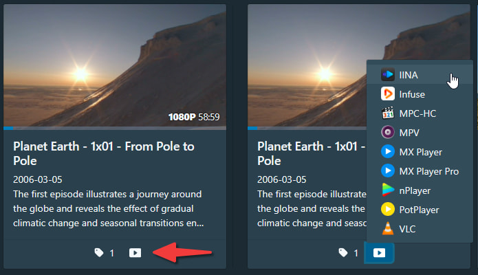
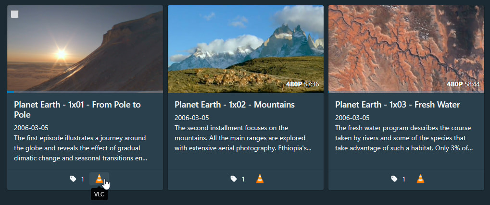
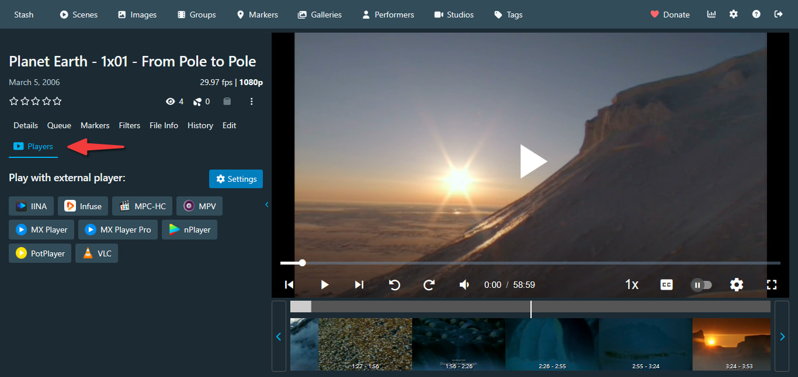

[English](README.md) | [简体中文](README.zh-Hans.md)

---

# External Player Launcher

This plugin adds support for launching videos in external media players from scene cards and scene detail pages.

## Supported Players

Supported media players and operating systems:

| Player | Windows | Android | iOS | macOS | Linux |
|--------|---------|---------|-----|-------|-------|
| IINA | | | | ✅ | |
| Infuse | | | ✅ | ✅ | |
| MPC-HC | ✅ (requires [mpc-protocol](https://github.com/muse90673/mpc-protocol/tree/develop)) | | | | |
| MPV | ✅ (requires [mpv-handler](https://github.com/akiirui/mpv-handler)) | ✅ | ✅ | | ✅ (requires [mpv-handler](https://github.com/akiirui/mpv-handler)) |
| MX Player (Pro) | | ✅ | | | |
| nPlayer | | | ✅ | ✅ | |
| PotPlayer | ✅ | | | | |
| VLC | ✅ (requires [vlc-protocol](https://github.com/muse90673/vlc-protocol/tree/develop)) | ✅ | ✅ | ✅ (requires [vlc-protocol](https://github.com/muse90673/vlc-protocol/tree/develop)) | ✅ (requires [vlc-protocol](https://github.com/muse90673/vlc-protocol/tree/develop)) |

## Features

- Adds a player dropdown menu at the bottom of scene cards for quickly selecting an external player
- When "Single player mode" is enabled, the dropdown is replaced with a single player button for one-click playback
- Scene detail pages also support launching external players
- Individual players can be shown or hidden in settings
- Settings are browser-local, so different devices can have different configurations

## Screenshots

Scene card:

Scene card (single player mode):

Scene detail:

## Installing the Plugin

See [Installing Plugins](/README.md#installing-plugins)

## Warning

This plugin may conflict with other plugins that modify scene cards, which could cause player buttons to disappear or appear in incorrect positions.

## Development

See [Development](/README.md#development)

## Acknowledgements

Portions of this plugin's code are derived from:
- [bpking1/embyExternalUrl](https://github.com/bpking1/embyExternalUrl) (MIT License)
  - [embyLaunchPotplayer.js](https://github.com/bpking1/embyExternalUrl/blob/main/embyWebAddExternalUrl/embyLaunchPotplayer.js)

## Contributing

Pull Requests and Issues are welcome.
